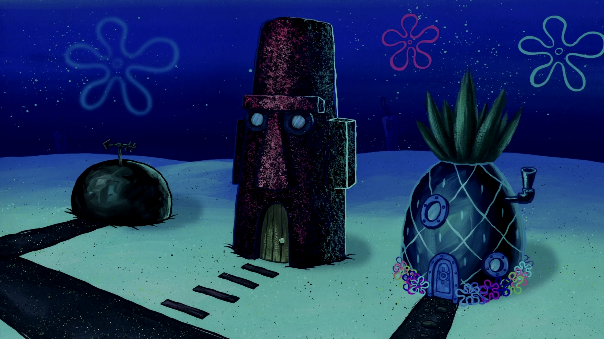
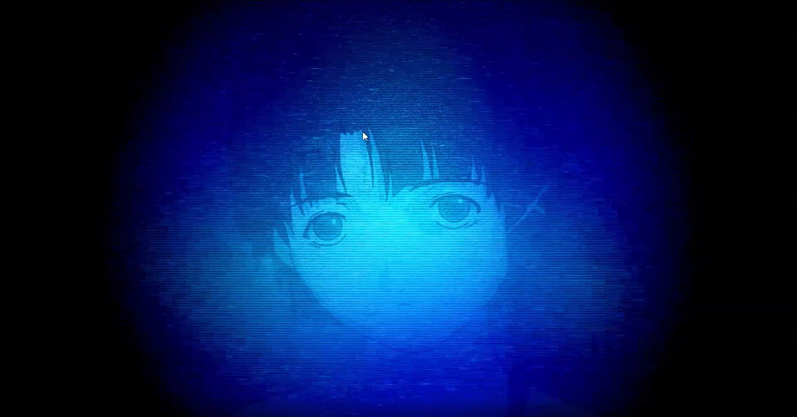

Welcome to the hub of my interactive wallpapers! Each wallpaper is a standalone project, accessible via GitHub Pages.
Just a reminder: you can get to use these wallpapers for free!

## 🌐 Wallpaper Gallery
- [SpongeBob Wallpaper](https://github.com/andreihmm/spongebob-wallpaper)
  

- [Lain Wallpaper](https://github.com/andreihmm/lain-wallpaper)
  

## Tutorial to use the wallpapers:
### Requirements:
- Lively Wallpaper (it's free can be found on Microsoft Store)

There are two ways that you can get to use one of the pages above as your wallpaper:
### First Way (recommended):
- Access one of the repositories above
- Click in the green "Code" button
- Download ZIP and save wherever you want
- Extract the files
- Open the Lively Wallpaper app
- Click the "+" button to add a new wallpaper
- Click the option "Choose an archive"
- Go to the extracted folder and select the index.html file
- Then you click "Ok" and activate your wallpaper

### Second way:
- Access one of the repositories above
- Copy the URL in the About section (at the right of the page)
- Open the Lively Wallpaper app
- Paste the URL in the "Insert URL" option and press the arrow
- Then you click "Ok" and activate your wallpaper

## 🌟 Contribute
If you enjoy my work, feel free to give a ⭐ on the repositories or suggest improvements! Also follow my GitHub profile!
